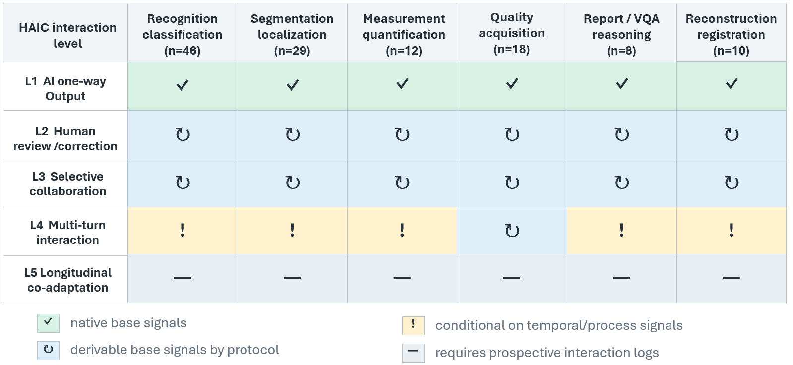

# Public Ultrasound Datasets for HAIC Research

This repository is the online living guide accompanying our HAIC-oriented analysis of public ultrasound datasets. It is not a general ultrasound-AI catalogue and it does not rank dataset quality. Its purpose is narrower:

> Given a public ultrasound dataset, what kind of human-AI collaboration (HAIC) task can be constructed from the signals it records?

The guide organizes public ultrasound resources by task family, identifies which HAIC levels can be supported by existing or derivable dataset signals, and marks when new user studies or prospective interaction logs are unavoidable.

## Core Idea

We separate two kinds of signals.

- **Base signals** decide whether a HAIC task can be constructed from a dataset. Examples include labels, masks, measurements, reports, scan states, model predictions, prediction-ground-truth differences, uncertainty scores, deferral rules, intermediate edits, and interaction logs.
- **Evaluation signals** measure how people actually use the task in a user study. Examples include preference, time cost, workload, accept/override behavior, trust calibration, reliance, skill retention, and clinical usefulness.

Public datasets can often provide or derive base signals for lower-level HAIC tasks, but they do not replace user studies for evaluating real workload, trust, handoff behavior, or clinical benefit.

## HAIC Levels

| Level | Interaction form | Required HAIC signals |
|---|---|---|
| L1 | AI one-way output | AI prediction and reference target. |
| L2 | Human review/correction | Accept, reject, or edit action; override decision; correction cost. |
| L3 | Selective collaboration | AI confidence or uncertainty; deferral rule; coverage; selective accuracy. |
| L4 | Multi-turn interaction | Intermediate states; user action sequence; per-turn AI update; turn-level cost; convergence trajectory. |
| L5 | Longitudinal co-adaptation | Trust calibration; reliance pattern; skill retention; strategy drift; repeated-use outcomes. |

## Task-Level Readiness Matrix

The matrix maps five HAIC levels to six common ultrasound task families. The column counts are approximate multi-label counts from the current statistical master list, so one dataset may contribute to multiple task families.

| Matrix code | Meaning |
|---|---|
| Native | The original dataset already contains the base target needed for this level. |
| Protocol-derived | Proxy base signals can be derived through a reproducible protocol, such as model predictions, prediction-ground-truth differences, confidence scores, or deferral rules. |
| Conditional | Support depends on dataset-specific temporal or process signals, such as scan sequences, probe states, intermediate edits, or interaction traces. |
| New logs required | Core base signals require new prospective human-AI interaction logs. |

The main boundary is L4. L2 and L3 are mostly outcome-level simulations: model outputs can be compared with existing annotations to estimate correction burden or deferral behavior. L4 is process-level and requires states and actions across turns. L5 remains prospective because repeated-use adaptation cannot be recovered from static images or labels.

## Repository Contents

| File | Role in the guide |
|---|---|
| [`data/statistical_dataset_master.csv`](data/statistical_dataset_master.csv) | Expanded living-guide table used for task-family counts and dataset coverage. |
| [`data/datasets.csv`](data/datasets.csv) | Curated working list with source links, papers, access notes, HAIC relevance, and limitations. |
| [`data/haic_annotations_curated.csv`](data/haic_annotations_curated.csv) | Compact signal annotations for reviewed and candidate resources. |
| [`docs/haic_task_taxonomy.md`](docs/haic_task_taxonomy.md) | Detailed explanation of task families, HAIC levels, and support codes. |
| [`docs/field_definitions.md`](docs/field_definitions.md) | Column definitions and maintenance rules. |
| [`docs/statistical_dataset_master.md`](docs/statistical_dataset_master.md) | Summary of the statistical master list. |

## Task-Family Dataset Index

This table gives a clickable starting point for primary or near-primary public resources in each task family. Cross-task benchmark collections are listed separately below instead of being treated as one dataset inside a single task family.

| Task family | Example public resources |
|---|---|
| Recognition / classification | [Fetal Planes DB](https://zenodo.org/record/3904280), [COVID-19 POCUS](https://github.com/jannisborn/covid19_ultrasound), [Open Kidney](https://github.com/nikhilroxtomar/Ultrasound-Kidney-Images), [Ultrasound Breast Images for Breast Cancer](https://www.kaggle.com/datasets/aryashah2k/ultrasound-breast-images-for-breast-cancer) |
| Segmentation / localization | [CAMUS](https://www.creatis.insa-lyon.fr/Challenge/camus/), [HC18](https://zenodo.org/records/1327317), [BUSI](https://scholar.cu.edu.eg/?q=afahmy/pages/dataset), [TN3K](https://github.com/haifangong/TRFE-Net-for-thyroid-nodule-segmentation) |
| Measurement / quantification | [EchoNet-Dynamic](https://echonet.github.io/dynamic/), [CAMUS](https://www.creatis.insa-lyon.fr/Challenge/camus/), [HC18](https://zenodo.org/records/1327317), [K2MUSE](https://www.kaggle.com/datasets/98d67c253a7c820668aed0690cae20343481b8f8f8e0dafbe93b0c76d91f0ce6) |
| Quality / acquisition | [Fetal Planes DB](https://zenodo.org/record/3904280), [FPUS23](https://doi.org/10.5281/zenodo.10040903), [African Fetal Standard Plane](https://doi.org/10.1038/s41598-023-29490-3), [K2MUSE](https://www.kaggle.com/datasets/98d67c253a7c820668aed0690cae20343481b8f8f8e0dafbe93b0c76d91f0ce6) |
| Report / VQA / reasoning | Primary public ultrasound resources remain limited; see benchmark collections below. |
| Reconstruction / registration | [PICMUS](https://www.creatis.insa-lyon.fr/Challenge/IEEE_IUS_2016/), [US simulation and segmentation](https://doi.org/10.1007/s11548-019-02046-5) |

## Benchmark Collections

Some resources are benchmark collections rather than single primary datasets. We keep them in the master table because they are useful for HAIC-oriented model evaluation, but we do not treat them as one dataset inside a single task family.

- [U2-BENCH](https://huggingface.co/datasets/DolphinAI/u2-bench) is a derived ultrasound LVLM benchmark spanning multiple anatomy regions and task types. Its underlying source datasets are tracked separately in [`data/statistical_dataset_master.csv`](data/statistical_dataset_master.csv).
- [OpenBiomedVid / MIMICEchoQA](https://arxiv.org/abs/2504.14391) is a video-language and echocardiography QA resource. It is useful for report/VQA/reasoning tasks, but it does not provide prospective human-AI interaction logs.

## Multi-Rater and Rater-Evaluation Resources

These resources are especially relevant to L3 selective collaboration because they expose expert variability, rater preference, or the question of which human should receive a deferred case.

| Resource | Why it matters for HAIC |
|---|---|
| [Open Kidney](https://github.com/nikhilroxtomar/Ultrasound-Kidney-Images) | Provides kidney masks, view labels, and two expert sonographer annotation sets, making it useful for multi-rater variability and defer-to-whom analysis. |
| [MCE Dataset](https://github.com/dewenzeng/MCE_dataset) | Provides myocardial contrast echocardiography frames with multiple cardiologist annotations, supporting disagreement-aware segmentation and uncertainty evaluation. |
| [SonoRate](https://github.com/13204942/SonoRate) | Provides a clinician-centered ranking/evaluation workflow for ultrasound AI segmentation outputs, useful for rater-subgroup analysis and human preference signals. |

## How to Use This Guide

1. Choose a conventional ultrasound task family, such as classification, segmentation, measurement, quality/acquisition, report/VQA, or reconstruction.
2. Use the matrix to identify the highest HAIC level that can be supported by the available base signals.
3. Check the dataset tables for source links, access conditions, task labels, and limitations.
4. Decide what must be added: model predictions for L2, uncertainty and deferral rules for L3, process logs for L4, or longitudinal user records for L5.
5. Design the user study separately to collect evaluation signals such as workload, correction time, trust, preference, reliance, and clinical usefulness.

## Scope and Caution

The guide consolidates public searches and dataset lists from surveys, benchmark papers, challenge pages, repositories, and recently added HAIC-relevant resources. Some entries are marked as candidates when access, license, or scope still needs verification.

K2MUSE is included as an ultrasound-adjacent process-rich resource because it contains time-synchronized A-mode ultrasound and locomotion signals. It should not be treated as a diagnostic B-mode ultrasound dataset.

## Contributing

Please open an issue or pull request using [`.github/ISSUE_TEMPLATE/add_dataset.md`](.github/ISSUE_TEMPLATE/add_dataset.md). Useful contributions include stable dataset links, papers, access notes, task-family corrections, HAIC signal annotations, and limitations relevant to user studies.

## License

This dataset guide is released under [CC BY 4.0](LICENSE).
