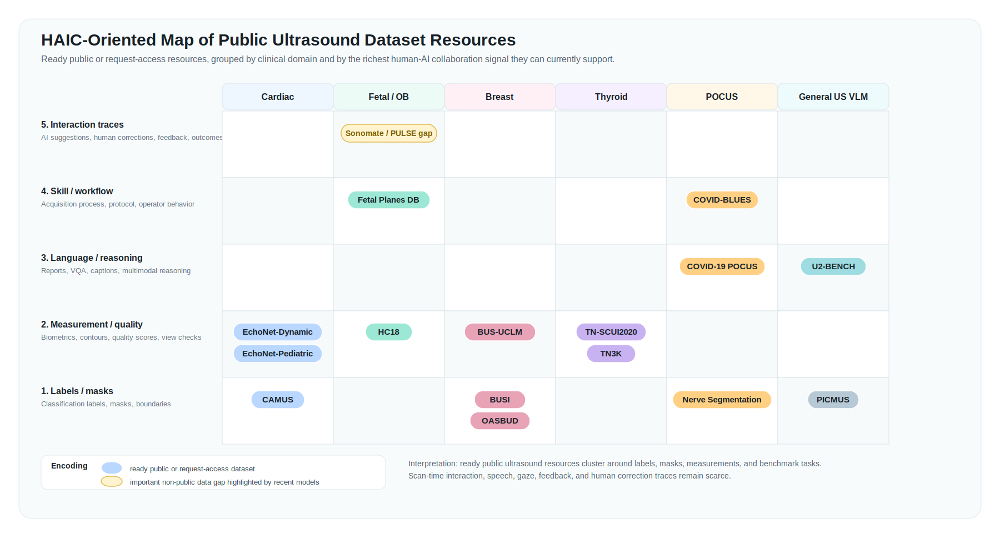

# Public Ultrasound Medical Datasets for HAIC Research

A curated, public dataset guide for ultrasound medical imaging and human-AI collaboration (HAIC) research.

This repository focuses on datasets that can help researchers, developers, and clinical collaborators quickly understand what public ultrasound data exists, which HAIC task levels can be built from it, and what still requires new user studies or prospective interaction logs.

## Scope

This list prioritizes:

- public or request-access ultrasound datasets;
- datasets with official download pages, challenge pages, or stable repositories;
- datasets with a paper, data descriptor, or representative high-impact usage paper;
- resources that can support HAIC topics such as AI-assisted diagnosis, report generation, quality assessment, skill augmentation, measurement support, active learning, and human-in-the-loop evaluation.

General radiology, pathology, and surgery datasets are useful for HAIC methodology, but they are not the main focus of this repository. The main table is ultrasound-first.

## Resource Layers

This repository keeps separate layers so the public list remains useful without overclaiming that every entry has been fully downloaded or clinically audited.

| Layer | File | Purpose |
|---|---|---|
| Curated working list | [`data/datasets.csv`](data/datasets.csv) | Verified or candidate ultrasound resources with links, papers, access notes, beginner tasks, HAIC relevance, and limitations. |
| HAIC annotation table | [`data/haic_annotations_curated.csv`](data/haic_annotations_curated.csv) | Signal-level annotations for reviewed resources, including task type, data type, HAIC use case, and limitations. Candidate resources remain explicitly marked when access or scope still needs verification. |
| Public ultrasound seed list | [`data/public_ultrasound_seed_npj2025.csv`](data/public_ultrasound_seed_npj2025.csv) | A broad seed table of 72 public ultrasound datasets reported in a recent public ultrasound resource catalogue. Entries in this file still require URL verification and HAIC annotation before being treated as ready-to-use recommendations. |
| Statistical master list | [`data/statistical_dataset_master.csv`](data/statistical_dataset_master.csv) / [`docs/statistical_dataset_master.md`](docs/statistical_dataset_master.md) | A deduplicated statistical pool combining the Guo/Alsharid 72-dataset seed list, U2-BENCH source datasets, and current curated-guide extras. Use this table for task-family counts and repository maintenance. |
| Annotation rubric | [`docs/haic_annotation_rubric.md`](docs/haic_annotation_rubric.md) | Documentation-based rules for compact signal tags and evidence review. |
| Field definitions | [`docs/field_definitions.md`](docs/field_definitions.md) | Column definitions and maintenance rules. |

The curated working list includes:

- official dataset or source links;
- paper or representative usage links;
- access status and license notes;
- beginner-friendly use cases;
- HAIC relevance;
- limitations for ultrasound human-AI collaboration.

## Base Signals, Evaluation Signals, and HAIC Readiness

The guide separates two kinds of signals.

- **Base signals** decide whether a HAIC task can be constructed from a public dataset. They include native labels, masks, measurements, reports, scan states, model predictions, prediction-ground-truth differences, uncertainty scores, deferral rules, intermediate edits, and interaction logs.
- **Evaluation signals** measure how humans actually use the task in a user study. They include preference, correction time, workload, accept/override behavior, trust calibration, reliance, skill retention, and clinical usefulness.

This distinction is central to the guide. Public datasets can often provide or derive base signals for L1-L3 HAIC tasks, but they do not replace user studies for evaluating real workload, trust, handoff behavior, or clinical benefit.

We use four support symbols in the task-level matrix:

| Symbol | Meaning |
|---|---|
| ✓ | Original dataset already contains the base target needed for the task. |
| ↻ | Proxy base signals can be derived through a reproducible protocol, such as adding model predictions, prediction-ground-truth differences, confidence scores, or deferral rules. |
| ! | Support depends on dataset-specific temporal or process signals, such as scan sequences, probe states, intermediate edits, or interaction traces. |
| - | Core base signals require new prospective human-AI interaction logs. |

## HAIC Task-Level Matrix

The figure below maps six ultrasound task families to five HAIC levels. It asks what base signals can be obtained from conventional datasets before adding a full user study.

Rows progress from one-way AI output to review/correction, selective collaboration, multi-turn interaction, and longitudinal co-adaptation. Columns represent common public ultrasound task families. The column counts are approximate multi-label counts from the statistical master list, so one dataset may appear in more than one task family.

A longer explanation is maintained in [`docs/haic_task_taxonomy.md`](docs/haic_task_taxonomy.md).

## Task-Family Dataset Index

The table below gives a clickable starting point for each task family. It is not exhaustive; the machine-readable source is [`data/statistical_dataset_master.csv`](data/statistical_dataset_master.csv).

| Task family | Example public resources |
|---|---|
| Recognition / classification | [Fetal Planes DB](https://zenodo.org/record/3904280), [COVID-19 POCUS](https://github.com/jannisborn/covid19_ultrasound), [Open Kidney](https://github.com/nikhilroxtomar/Ultrasound-Kidney-Images), [U2-BENCH](https://huggingface.co/datasets/DolphinAI/u2-bench) |
| Segmentation / localization | [CAMUS](https://www.creatis.insa-lyon.fr/Challenge/camus/), [HC18](https://zenodo.org/records/1327317), [BUSI](https://scholar.cu.edu.eg/?q=afahmy/pages/dataset), [TN3K](https://github.com/haifangong/TRFE-Net-for-thyroid-nodule-segmentation), [MCE Dataset](https://github.com/dewenzeng/MCE_dataset), [Open Kidney](https://github.com/nikhilroxtomar/Ultrasound-Kidney-Images) |
| Measurement / quantification | [EchoNet-Dynamic](https://echonet.github.io/dynamic/), [CAMUS](https://www.creatis.insa-lyon.fr/Challenge/camus/), [HC18](https://zenodo.org/records/1327317), [K2MUSE](https://www.kaggle.com/datasets/98d67c253a7c820668aed0690cae20343481b8f8f8e0dafbe93b0c76d91f0ce6) |
| Quality / acquisition | [Fetal Planes DB](https://zenodo.org/record/3904280), [FPUS23](https://doi.org/10.5281/zenodo.10040903), [Open Kidney](https://github.com/nikhilroxtomar/Ultrasound-Kidney-Images), [K2MUSE](https://www.kaggle.com/datasets/98d67c253a7c820668aed0690cae20343481b8f8f8e0dafbe93b0c76d91f0ce6) |
| Report / VQA / reasoning | [U2-BENCH](https://huggingface.co/datasets/DolphinAI/u2-bench), [OpenBiomedVid / MIMICEchoQA](https://arxiv.org/abs/2504.14391), [FPUS23](https://doi.org/10.5281/zenodo.10040903) |
| Reconstruction / registration | [PICMUS](https://www.creatis.insa-lyon.fr/Challenge/IEEE_IUS_2016/), [US simulation and segmentation](https://doi.org/10.1007/s11548-019-02046-5) |

## Related Resource Catalogues

Prior ultrasound AI reviews have summarized model tasks and domain-specific applications. Recent public resource catalogues have also mapped public ultrasound datasets and open-source ultrasound models. This repository uses those efforts as background, but focuses on a different practical question: which public ultrasound resources are usable for HAIC studies, and what human-centered signals are missing?

- [On the public dissemination and open sourcing of ultrasound resources, datasets and deep learning models](https://pmc.ncbi.nlm.nih.gov/articles/PMC12722232/)
- [Deep Learning in Medical Ultrasound Analysis: A Review](https://www.sciencedirect.com/science/article/pii/S2095809918301887)
- [A review of deep learning in fetal ultrasound imaging](https://www.sciencedirect.com/science/article/pii/S1361841522002572)

## Dataset Map

The yellow **Sonomate / PULSE** marker is not listed as a public dataset. It highlights an important non-public data pattern: Sonomate was trained mainly on PULSE, a fetal ultrasound video-audio dataset that captures sonographer speech and scan-time context. We place it in the highest interaction-signal row because it shows the kind of temporally grounded human experience that future public HAIC datasets should capture, even though the dataset itself is not openly available.

GitHub renders the map as a single image, so the links below provide direct access to the datasets shown in the figure.

| Domain | Dataset links |
|---|---|
| Cardiac | [EchoNet-Dynamic](https://echonet.github.io/dynamic/) / [EchoNet-Pediatric](https://echonet.github.io/pediatric/) / [CAMUS](https://www.creatis.insa-lyon.fr/Challenge/camus/) |
| Fetal / OB | [Fetal Planes DB](https://zenodo.org/record/3904280) / [HC18](https://zenodo.org/records/1327317) / [Sonomate / PULSE gap](https://www.nature.com/articles/s41551-025-01578-3) |
| Breast | [BUS-UCLM](https://github.com/noeliavallez/BUS-UCLM-Dataset) / [BUSI](https://scholar.cu.edu.eg/?q=afahmy/pages/dataset) / [OASBUD](https://zenodo.org/record/545928) |
| Thyroid | [TN3K](https://github.com/haifangong/TRFE-Net-for-thyroid-nodule-segmentation) |
| POCUS | [COVID-BLUES](https://huggingface.co/datasets/jannisborn/COVID-BLUES) / [COVID-19 POCUS](https://github.com/jannisborn/covid19_ultrasound) / [Nerve Segmentation](https://www.kaggle.com/c/ultrasound-nerve-segmentation) |
| General US VLM | [U2-BENCH](https://huggingface.co/datasets/DolphinAI/u2-bench) |

**Imaging research note.** PICMUS is kept in `data/datasets.csv` as an ultrasound imaging research resource, but it is not shown in the clinical HAIC map above. PICMUS is a plane-wave ultrasound imaging challenge built around raw pre-beamformed channel data for beamforming and image reconstruction, rather than a clinical diagnosis, reporting, or interaction dataset.

## Starter View

| Dataset | Ultrasound area | Public source | Paper/source | Beginner use | HAIC relevance |
|---|---|---|---|---|---|
| EchoNet-Dynamic | Echocardiography video | [Project](https://echonet.github.io/dynamic/) | [Nature 2020](https://www.nature.com/articles/s41586-020-2145-8) | Ejection fraction and measurement assistance | Video-based interpretation and measurement workflow |
| CAMUS | Echocardiography | [Challenge](https://www.creatis.insa-lyon.fr/Challenge/camus/) | [IEEE TMI 2019](https://doi.org/10.1109/TMI.2019.2900516) | Cardiac chamber segmentation | Human-AI measurement and contour correction |
| Fetal Planes DB | Fetal ultrasound | [Zenodo](https://zenodo.org/record/3904280) | [Scientific Reports 2020](https://www.nature.com/articles/s41598-020-67076-5) | Standard-plane classification | Skill support for view acquisition |
| HC18 | Fetal ultrasound | [Zenodo](https://zenodo.org/records/1327317) | [PLOS ONE 2018](https://pmc.ncbi.nlm.nih.gov/articles/PMC6107118/) | Head circumference measurement | Measurement assistance and quality control |
| BUSI | Breast ultrasound | [Dataset page](https://scholar.cu.edu.eg/?q=afahmy/pages/dataset) | [Data in Brief 2019](https://doi.org/10.1016/j.dib.2019.104863) | Lesion classification and segmentation | AI-assisted lesion localization |
| OASBUD | Breast ultrasound | [Zenodo](https://zenodo.org/record/545928) | [Medical Physics](https://doi.org/10.1002/mp.12538) | Lesion analysis with RF data | Reader support and uncertainty studies |
| BUS-UCLM | Breast ultrasound | [GitHub](https://github.com/noeliavallez/BUS-UCLM-Dataset) | [Scientific Data 2025](https://doi.org/10.1038/s41597-025-04562-3) | Lesion segmentation | Interactive boundary correction |
| COVID-19 POCUS | Point-of-care ultrasound | [GitHub](https://github.com/jannisborn/covid19_ultrasound) | [Applied Sciences 2021](https://doi.org/10.3390/app11020672) | Video classification and triage | POCUS training and triage support |
| COVID-BLUES | Point-of-care ultrasound | [Hugging Face](https://huggingface.co/datasets/jannisborn/COVID-BLUES) | [arXiv/JBHI 2025](https://arxiv.org/abs/2509.10556) | Protocol-aware lung ultrasound analysis | POCUS workflow and severity assessment |
| DDTI | Thyroid ultrasound | Candidate: official source unstable | [SPIE 2015](https://doi.org/10.1117/12.2073532) | Thyroid nodule classification and segmentation | Ultrasound reporting and localization baseline |
| TN3K | Thyroid ultrasound | [Repository](https://github.com/haifangong/TRFE-Net-for-thyroid-nodule-segmentation) | [CBM 2022](https://doi.org/10.1016/j.compbiomed.2022.106389) | Thyroid nodule segmentation | Interactive segmentation and correction baseline |
| U2-BENCH | Ultrasound VLM benchmark | [Hugging Face](https://huggingface.co/datasets/DolphinAI/u2-bench) | [arXiv 2025](https://arxiv.org/abs/2505.17779) | LVLM evaluation | Ultrasound assistant evaluation |
| Open Kidney | Kidney ultrasound | [GitHub](https://github.com/nikhilroxtomar/Ultrasound-Kidney-Images) | [arXiv 2022](https://arxiv.org/abs/2206.06657) | Kidney segmentation and view labels | Multi-rater variability and defer-to-whom analysis |
| MCE Dataset | Myocardial contrast echocardiography | [GitHub](https://github.com/dewenzeng/MCE_dataset) | [arXiv 2021](https://arxiv.org/abs/2106.15597) | Multi-rater myocardial segmentation | Expert variability and uncertainty-aware segmentation |
| SonoRate | Fetal ultrasound AI evaluation | [GitHub](https://github.com/13204942/SonoRate) | [arXiv 2026](https://arxiv.org/abs/2606.19174) | Clinician-centered ranking workflow | Human preference and rater-subgroup evaluation |
| OpenBiomedVid / MIMICEchoQA | Biomedical video and echocardiography QA | [arXiv](https://arxiv.org/abs/2504.14391) | [arXiv 2025](https://arxiv.org/abs/2504.14391) | Video-language and echo QA evaluation | Report/VQA/reasoning base signals without interaction logs |
| K2MUSE | Rehabilitation ultrasound sensing | [Kaggle](https://www.kaggle.com/datasets/98d67c253a7c820668aed0690cae20343481b8f8f8e0dafbe93b0c76d91f0ce6) | [arXiv 2025](https://arxiv.org/abs/2504.14602) | A-mode ultrasound and locomotion time-series modeling | Process-rich ultrasound-adjacent data for L4-style temporal signals |

## Recent Ultrasound Models and Public Dataset Links

Many recent ultrasound foundation models are trained on institutional or newly collected private data. For new HAIC researchers, the most useful question is often: which public datasets can reproduce part of the evaluation, provide a baseline, or reveal what public data is still missing?

| Model or benchmark | Ultrasound area | Public dataset connection | Reported performance signal | HAIC takeaway |
|---|---|---|---|---|
| EchoCLIP / EchoCLIP-R | Echocardiography | Uses public EchoNet-Dynamic for external validation, while large-scale pretraining data are institutional | Reports clinically useful zero-shot and retrieval performance for echo interpretation tasks | EchoNet-Dynamic is a key public cardiac ultrasound evaluation resource, but public report-video pairs remain scarce |
| CAMUS-based echo segmentation models | Echocardiography | CAMUS is a standard public segmentation and measurement benchmark | Strong baselines focus on chamber contours and ejection fraction estimation | Good beginner entry point for human-AI contour correction and measurement consistency studies |
| Fetal plane classification models | Fetal ultrasound | Fetal Planes DB provides public standard-plane labels and operator/machine metadata | Commonly used for fetal standard-plane classification | Useful for acquisition-skill support, but lacks view-search trajectories and trainee feedback |
| HC18 fetal measurement models | Fetal ultrasound | HC18 provides public fetal head circumference annotations | Used for automated fetal head circumference segmentation and measurement | Good benchmark for measurement assistance and human correction of biometric contours |
| BUSI / OASBUD / BUS-UCLM breast ultrasound models | Breast ultrasound | Public breast ultrasound datasets support lesion classification, segmentation, and quantitative ultrasound analysis | Many papers report high classification or segmentation scores, but protocols vary widely | Good for entry-level lesion localization; weak for HAIC unless paired with reader uncertainty or correction logs |
| AbVLM-Q | Abdominal ultrasound | Uses a multi-center abdominal standard-plane quality dataset; public release should be verified before listing as ready | Reports high plane classification/key-structure detection and quality assessment performance | Shows what HAIC-ready ultrasound quality data should include: standard planes, anatomy checks, and expert quality scores |
| COVID-19 POCUS / COVID-BLUES models | Point-of-care ultrasound | Public GitHub/Hugging Face resources support lung ultrasound classification and severity analysis | Explainable POCUS models and newer prospective COVID-BLUES evaluations target lung pathology detection | Useful for protocol-aware POCUS triage and training; older aggregated data need careful split design |
| TN3K thyroid segmentation models | Thyroid ultrasound | TN3K is a public thyroid nodule segmentation resource associated with TRFE-Net | TRFE-Net reports strong thyroid nodule segmentation performance in Computers in Biology and Medicine | Useful for interactive segmentation and annotation-efficiency baselines |
| Dolphin / U2-BENCH | General ultrasound LVLM | U2-BENCH is publicly released on Hugging Face by DolphinAI | Benchmarks LVLMs across ultrasound classification, detection, regression, and generation tasks | Important public resource for ultrasound assistant evaluation, but not a full clinical interaction dataset |
| Sonomate | Fetal ultrasound | Trained mainly on the non-public PULSE fetal ultrasound video-audio dataset and evaluated in part with the public Fetal Planes DB | Demonstrates visually grounded fetal ultrasound understanding from sonographer scan videos and speech | Strong HAIC example: useful ultrasound datasets should capture sonographer experience, temporal language, scanning context, and visual grounding, not only final labels |
| FetalMind / other fetal VLMs | Fetal ultrasound | Often rely on large fetal ultrasound image-report/video-report collections that are not fully public | Report strong fetal interpretation, grounding, or assistant-style capabilities | These models motivate future public fetal HAIC datasets with reports, gaze, speech, and acquisition process traces |

## HAIC Lens for Ultrasound Dataset Design

This list is intended not only to help users find data, but also to clarify what human-AI collaboration in ultrasound could look like.

- **Sonographer experience as data**: Sonomate shows the value of pairing fetal ultrasound video with spoken sonographer reasoning and temporal grounding. Public datasets rarely contain this kind of scan-time human signal.
- **Contextual AI for interventions**: The CAI4CAI framework argues that computer-assisted intervention systems need context, human factors, shared representations, and collaborative decision-making rather than isolated image classification alone.
- **Skill augmentation**: For ultrasound, HAIC data should include acquisition quality, view-search behavior, probe movement, operator expertise, and feedback loops. Fetal Planes DB and HC18 are useful starting points, but they capture only part of the skill workflow.
- **Human-AI complementarity**: Measurement and segmentation datasets such as CAMUS, HC18, BUSI, BUS-UCLM, and TN3K can support studies where humans correct AI outputs, compare uncertainty, or evaluate time savings, but they usually lack logged interaction traces.
- **Explainability and trust**: POCUS and breast/thyroid lesion datasets can support explanation methods, but HAIC studies should evaluate whether explanations actually improve clinician decisions, workload, and calibration.
- **From model benchmark to collaboration benchmark**: U2-BENCH is important for ultrasound LVLM evaluation, while future HAIC benchmarks should additionally record human prompts, AI responses, human corrections, confidence changes, and task outcomes.

Useful HAIC-oriented references:

- [A visually grounded language model for fetal ultrasound understanding](https://www.nature.com/articles/s41551-025-01578-3)
- [CAI4CAI: The Rise of Contextual Artificial Intelligence in Computer Assisted Interventions](https://doi.org/10.1109/JPROC.2019.2946993)
- [Human-AI Collaboration and Explainability for 2D/3D Registration Quality Assurance](https://arxiv.org/abs/2507.17597)

Legacy note: DDTI is a historically important thyroid ultrasound dataset, but the original public access pages appear unstable. It is kept as a candidate at the end of `data/datasets.csv` until a stable legitimate source is confirmed.

## How New Researchers Can Use This List

1. Choose a clinical ultrasound area: cardiac, fetal, breast, thyroid, abdominal, vascular, or POCUS.
2. Start with datasets that have stable public links and clear papers.
3. Match the dataset to a HAIC question:
   - Can AI help a clinician measure more consistently?
   - Can AI help a trainee acquire a better standard plane?
   - Can AI explain where a lesion or anatomy is located?
   - Can AI reduce disagreement or uncertainty?
   - Can a human correct AI outputs efficiently?
4. Check what human signal is available: labels, masks, measurements, reports, view quality, videos, multi-reader annotations, or workflow traces.
5. Document what is missing before designing a new data collection protocol.

## Why This Matters for Ultrasound HAIC

Most public ultrasound datasets are useful for model development but incomplete for HAIC. They often provide images, videos, labels, and masks, but rarely include:

- probe trajectory and contact force;
- operator gaze, speech, or intention;
- trainee/expert skill labels;
- view-search process before the final saved frame;
- AI suggestion logs and human correction behavior;
- multi-clinician disagreement and confidence;
- workflow context linking acquisition, diagnosis, reporting, and intervention.

This gap motivates future ultrasound HAIC datasets that record both the medical images and the human-AI collaboration process.

## Contributing

Please open an issue or pull request using `.github/ISSUE_TEMPLATE/add_dataset.md`.

Useful contributions include:

- adding a public ultrasound dataset;
- adding an official download link;
- adding a paper or highly cited usage paper;
- correcting license or access notes;
- adding a HAIC use case;
- explaining a limitation that new users should know.

## License

This dataset guide is released under [CC BY 4.0](LICENSE).

