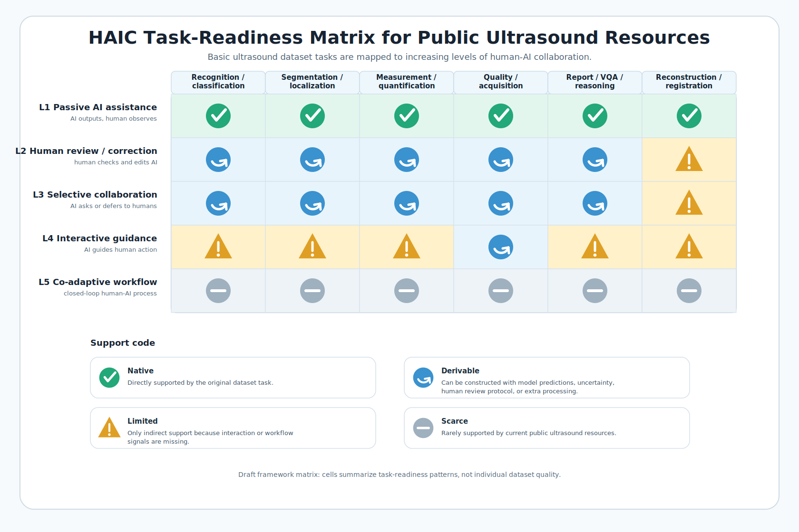

# HAIC Task-Level Taxonomy for Ultrasound Resources

This is a draft framework for discussing how public ultrasound resources can be adapted to different levels of human-AI collaboration (HAIC). It is separate from the dataset-level annotation tables and does not replace the existing curated dataset guide.

## 中文说明

这份表格不评价某一个具体数据集的好坏，而是把公开超声数据集常见的**基础任务类型**放在横轴，把 HAIC 中从被动辅助到共适应工作流的人机交互层级放在纵轴。它的目的是回答一个更接近 HAIC 的问题：一个原本为分类、分割、测量、VQA 或重建等任务采集的数据集，经过怎样的改造后可以支持哪一层人机协作研究？

热力图中的 `Native` 表示该基础任务天然支持这一层级；`Derivable` 表示需要生成 AI prediction、uncertainty、human review protocol 或额外处理后可以构造该层级任务；`Limited` 表示只能间接支持，因为缺少关键交互或 workflow 信号；`Scarce` 表示当前公开超声资源基本很少支持。

This document defines the task-family axis and HAIC interaction-level axis used for the task-readiness heatmap.

## Basic Task Families

Public ultrasound datasets are commonly collected for one or more of the following basic task families:

| Task family | Meaning | Typical examples |
|---|---|---|
| Recognition / classification | Predict an image, video, view, disease, or anatomy class. | Disease classification, standard-plane recognition, view classification. |
| Segmentation / localization | Locate anatomy, lesions, instruments, or regions of interest. | Organ masks, lesion masks, bounding boxes, nerve segmentation. |
| Measurement / quantification | Estimate clinical quantities or derive measurements from images/videos. | Ejection fraction, head circumference, chamber volume, severity score. |
| Quality / acquisition guidance | Assess image quality, protocol compliance, or acquisition state. | View quality, standard-plane feedback, protocol point recognition. |
| Report / VQA / reasoning | Connect ultrasound data to language, questions, reports, captions, or reasoning tasks. | VQA, report generation, captioning, LVLM evaluation. |
| Reconstruction / registration | Improve, reconstruct, align, or spatially transform ultrasound data. | Beamforming, enhancement, 3D reconstruction, registration. |

## HAIC Interaction Levels

The HAIC levels describe the human-AI relationship supported by a task setting. They are not dataset-quality scores.

| Level | Human-AI relationship | Meaning |
|---|---|---|
| L1 Passive AI assistance | AI outputs, human observes. | AI produces labels, masks, measurements, reports, quality scores, or reconstructions. |
| L2 Human review / correction | Human checks and edits AI output. | Human accepts, rejects, corrects, or edits AI predictions. |
| L3 Selective collaboration / learning to defer | AI decides when to ask humans. | AI estimates uncertainty, flags difficult cases, or defers to experts. |
| L4 Interactive guidance | AI guides human action during a task. | AI gives scan, view, quality, protocol, or reporting guidance while the user acts. |
| L5 Co-adaptive workflow | Human and AI adapt to each other over time. | Human feedback changes AI behavior, and AI output changes human workflow across a logged process. |

## Support Codes

| Code | Meaning |
|---|---|
| Native | The basic task family directly supports this interaction level. |
| Derivable | The level can be constructed by adding model predictions, uncertainty, simulated review, or an evaluation protocol. |
| Limited | The level can only be studied indirectly because key interaction or workflow signals are missing. |
| Scarce | Public ultrasound resources rarely support this level with current documentation. |
